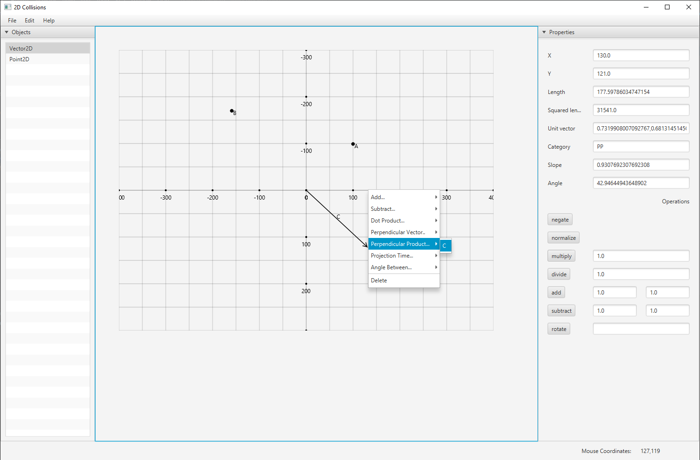

# Math 2D

> Tool for visualizing vectors, calculating visually vectors (adding, subtracting, dot, cross product), trigonometry etc.

 

## Getting started 
The project is a multi-module maven project consisting of:

- [gui](gui/)
- [math](math/)

To get a local copy up and running follow these simple example steps. 

### Prerequisites
This section will describe requirements needed to satisfy the installation or running of the project.

 - Java 17
 - Maven
 
### Nice to have
 - Intellij

### Build
 - `git clone https://github.com/Tanevski3/math-2d.git`
 - `cd ./math-2d`
 - `mvn clean install`
 
### Run
 - Right click and run `MainEntry.java`
 
### Test
 - Run `mvn test`

## Future changes

- expand the accordions
- Improve about section with: why I built this tool and how I use it
- Implement other math operations
- improve code, separation of concerns, single responsibility, reduce duplication, maybe event buss
- move and delete commands cant be undo
- Improve GUI interaction
- Write unit tests
 
## Contact

For contact, you can reach me at [marjantanevski@outlook.com](marjantanevski@outlook.com).

## License

MIT © [Marjan Tanevski](marjantanevski@outlook.com)