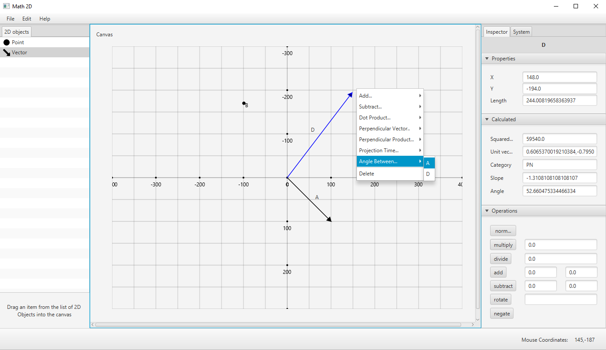

# Math 2D

> Tool for visualizing vectors, calculating visually vectors (adding, subtracting, dot, cross product), trigonometry etc.

 

## Getting started

The project is a multi-module maven project consisting of:

- [gui](gui/)
- [math](math/)

To get a local copy up and running follow these simple example steps.

### Prerequisites

This section will describe requirements needed to satisfy the installation or running of the project.

- Java 17
- Maven

### Nice to have

- Intellij

### Build

- `git clone https://github.com/Tanevski3/math-2d.git`
- `cd ./math-2d`
- `mvn clean install`

### Run

- Right click and run `MainEntry.java`

### Test

- Run `mvn test`

## Future changes

- make sure the dot product and other scalar values can be copied
- improve colors when selecting vectors and points
- colorize vectors, change color context menu
- zoom in/out function
- implement cross product, get projection point, get vector, shortenLength
- docs under operations
- Open, Save, Save as functionality

- separation of concerns, maybe event bus
- always expand Inspect accordions
- write unit tests

## Contact

For contact, you can reach me at [marjantanevski@outlook.com](marjantanevski@outlook.com).

## License

MIT © [Marjan Tanevski](marjantanevski@outlook.com)
